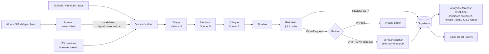

# Module and package architecture

One Python worker (Railway), one Postgres + Storage project (Supabase), one dormant approval endpoint (Vercel, LIVE only).
Everything the worker knows is in the database; the worker is restart-safe (§8.8).

## Package layout (`src/tradeagent/`)
```
tradeagent/
  domain/            enums.py, models.py            typed models shared by every module (P0 ✔)
  interfaces/        __init__.py                    Protocols for adapters and services (P0 ✔)
  config/            loader.py                      YAML → validated Settings; config_version; LIVE lockout (P0 ✔)
  exclusions.py                                     ethical screen over denylist + SIC backstop (P0 ✔)
  versioning/        registry.py, phases.py         version registries, boot drift check, phase opening (ADR-0019)   S1 ✔
  persistence/       db.py                          psycopg Database over the schema; cash-chain verify             S1 ✔
  adapters/
    alpaca/          market_data.py ✔ (SIP_DELAYED, IEX_REALTIME, SIP_REALTIME), assets.py ✔, news.py ✔, client.py ✔,
                     calendar.py ✔, broker_null.py ✔, broker_paper.py ✔ (orders, positions, activities, account
                     configuration), corporate_actions.py ✔, stream.py                                        S2/S3 ✔ / S6
    edgar/           client.py ✔ (tickers, submissions, fair-access throttle), filings.py, xbrl.py                S2 ✔ / S5
    finnhub/         earnings.py ✔                                                                            S2 ✔
    typesafe/        jev.py ✔, questions.py ✔ (ADR-0023 judgment engine)                                       S2 ✔
    email/           resend.py, smtp.py, templates/                                                           S4
  data/              registry.py ✔ (primary/fallback per domain, health, source_status), staleness.py         S2 ✔ / S4
  universe/          builder.py ✔ (ADR-0005 membership test + ADR-0003 floors + exclusions)                    S2 ✔
  scanner/           signals/{technical,catalyst}.py ✔ (tier-aware; Jev catalysts), composite.py ✔ (ADR-0008),
                     regime.py ✔ (ADR-0009), scanner.py ✔ (pure), runner.py ✔ (I/O + persist)                S2 ✔
  agent/             dossier.py, prompts/ (versioned files), llm_client.py, triage.py, decide.py, critique.py,
                     reviews.py                                                                                S5/S6
  risk/              desk.py (§8.1 order), sizing.py, budget.py, guards.py                                    S4
  execution/         broker_policy.py ✔ (§8.10), reconcile.py ✔ (§8.6), ledger_apply.py ✔ (fill → position → lots →
                     fees → cash), stops.py ✔ (ADR-0013), corporate.py ✔, broker_factory.py ✔; orders.py (state
                     machine client), executor.py, ext_hours.py, reconstruction.py (ADR-0017 fill model)      S3 ✔ / S4/S6
  portfolios/        primary.py, quant_baseline.py (QB-1.0), benchmarks.py, critique_shadow.py (ADR-0018),
                     deterministic_exit_shadow.py                                                              S4/S6
  analytics/         forecast_resolution.py (ADR-0017), candidate_outcomes.py, closed_trades.py,
                     report.py (§13.3, ADR-0016), fees.py (ADR-0012)                                           S4/S7
  ops/               scheduler.py ✔, boot.py ✔, checks.py ✔, jobs.py ✔ (scan jobs; composition root),
                     halts.py, notifications.py, context_prune.py (§10.4), digest.py                           S1–S4
  cli.py             `tradeagent run | boot-check | report | verify-projections | probe-fractional-stop`       S1+
```
Dependency direction: `adapters → domain`; `scanner/agent/risk/execution/portfolios/analytics → domain + interfaces +
persistence`; `ops` composes everything. No module imports an adapter concretely except the composition root
(`ops/boot.py`), which is where `MARKET_DATA_PLAN` and `EXECUTION_MODE` select implementations (ADR-0015, ADR-0020).

## Runtime processes and jobs (single worker, in-process scheduler on the Alpaca calendar)
```
boot ─► load settings (LIVE refused) ─► migrations current? ─► exposure checks: Data API 401/404, bucket private (ADR-0022)
     ─► version drift → phase (ADR-0019) ─► verify projections
     ─► broker policy (§8.10, PAPER) ─► reconciliation (§8.6) ─► clear/raise halts ─► scheduler.run_forever()

per session (ET):
 09:05 corporate actions → lots        09:10 stop re-arm (ADR-0013)        09:31/09:33 post-open stop verification
 09:2x pre-open scan on prior-day data (regime, universe, candidates)     10:00+ intraday scans every 15 min
 each scan: exits/reviews first ─► triage (if thresholds) ─► decision ─► critique ─► finalize ─► risk desk
            ─► [lock portfolio → reserve capital → create order] atomically (ADR-0021) ─► execute
 continuous: early-warning stream on the focus set (ADR-0014) → triggered reviews; broker event polling → ledger
 T+15 min after each simulated order: fill reconstruction (§8.9)          16:05 daily reviews (triage model)
 after close: fees & dividends, candidate_outcomes, forecast resolution, closed_trades, benchmarks mark, digest email
 nightly: context-blob prune (90 d), projection verification, budget roll
```

## Data flow (mermaid)


## Portfolios running side by side
| Portfolio | Kind | Broker | Fills | Exits |
|---|---|---|---|---|
| Primary LLM | `llm_primary` | PAPER: Alpaca paper; DRY_RUN: none | broker or reconstructed | LLM-managed + broker stops |
| QB-1.0 | `quant_shadow` | none | reconstructed | deterministic |
| Cash / SPY / VTI | `benchmark_*` | none | marked daily | — |
| Critique paired / parallel | `critique_shadow_*` | none | reconstructed | deterministic (ADR-0018) |
| Deterministic-exit twins | `deterministic_exit_shadow` | none | reconstructed | entry stop/target/time stop |

Only the primary can carry broker fills (schema-enforced).

## Mode isolation (ADR-0020)
`EXECUTION_MODE` selects `NullBroker` (DRY_RUN; reads the paper API with paper keys for the pre-open probe and
reconciliation dry-run, never submits) or `AlpacaPaperBroker` (PAPER). There is no live broker class; `LIVE` is refused
by the config loader and by the database.

## Deployment (owner actions, §11)
- Railway project `trading-agent` (worker service, `python -m tradeagent.cli run`), env vars: `EXECUTION_MODE`,
  `ALPACA_PAPER_KEY/SECRET`, `ANTHROPIC_API_KEY`, `FINNHUB_API_KEY`, `RESEND_API_KEY`, `DATABASE_URL`,
  `SUPABASE_URL/SERVICE_ROLE_KEY`, `EDGAR_USER_AGENT`, `RAILWAY_GIT_COMMIT_SHA` (auto).
- Supabase project `trading-agent`: apply `supabase/migrations/` with the Supabase CLI (as the schema owner); leave schema
  `trading` **out** of the Data API exposed-schemas list; `alter role trading_worker login password '…'` and put that URL in
  Railway `DATABASE_URL`; private Storage bucket `decision-context` (ADR-0022). The worker never holds the service-role key
  for data access.
- Vercel project `trading-agent-approvals`: not deployed until the LIVE slice.
